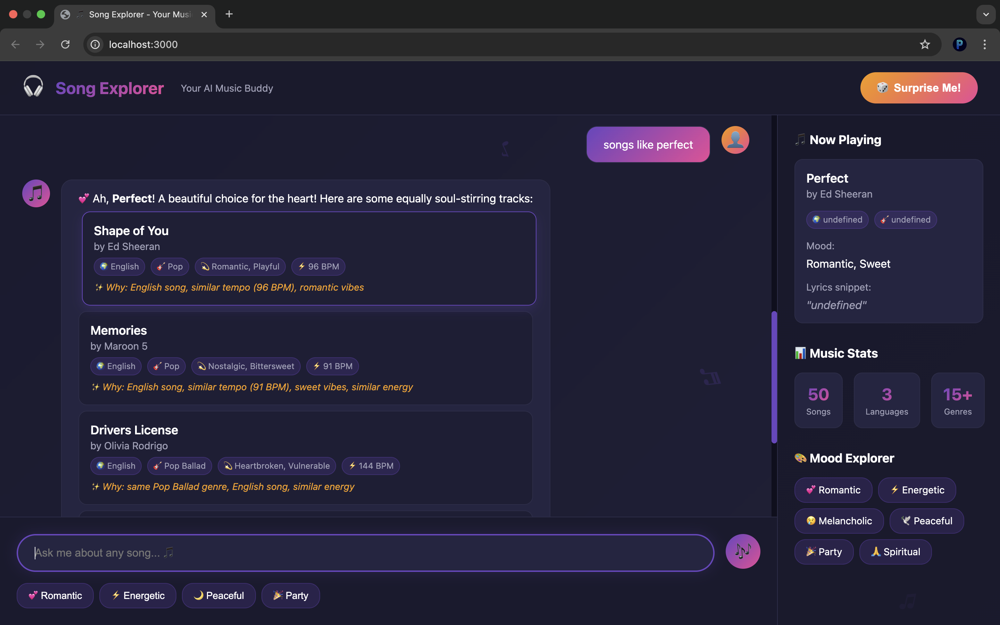

# 🎶 RECmusic — Song Explorer Chatbot


A playful, music-themed chatbot that helps you discover songs by mood, language, and similarity. It combines metadata scoring with semantic embeddings (RAG) to deliver relevant, friendly recommendations.

## ✨ Features
- Hybrid retrieval (metadata + semantic embeddings)
- Multi-language dataset: Hindi, Marathi, English (50 songs)
- Smart search parsing for language and mood (e.g., "marathi romantic")
- Natural, personalized replies with reasons for picks
- Fun UI with animated notes and a "Now Playing" sidebar

## 🧠 Tech Stack
- Backend: Node.js (Express, CORS, dotenv)
- Retrieval: Fuse.js (fuzzy search), @xenova/transformers (all-MiniLM-L6-v2)
- NLP helpers: natural
- Frontend: HTML + CSS + JavaScript

## 🚀 Getting Started
Prerequisites:
- Node.js 18+

Install and run:
```bash
npm install
node server.js
# App runs at http://localhost:3000
```

Optional (auto-reload during development):
```bash
npx nodemon server.js
```

## 🔌 API Endpoints
- POST `/api/search`
  - Body: `{ "query": "marathi romantic" }`
  - Returns: filtered, fuzzy-matched results with optional `languageFilter` and `moodFilter`

- POST `/api/recommend`
  - Body: `{ "query": "songs like perfect" }` or `{ "songTitle": "Perfect" }`
  - Returns: target song + recommendations with short reasons

## 🔍 Example Queries
- "marathi romantic"
- "hindi energetic"
- "songs like perfect"
- "similar to tum hi ho"
- "peaceful english"

## 📸 Screenshots




## 📚 Dataset
Each song has: `title`, `artist`, `language`, `genre`, `tempo`, `key`, `acousticness`, `energy`, `danceability`, `mood`, and a lyric snippet. See `data/songs_dataset.js`.

## 🧩 How It Works (RAG)
- Embeddings: `Xenova/all-MiniLM-L6-v2` via `@xenova/transformers`
- Metadata scoring: weights for genre, language, mood, tempo, energy, acousticness, danceability
- Hybrid merge: combine and deduplicate top results, then generate human-friendly reasons

## 🛤️ Roadmap
- Better multi-language normalization and stemming
- Advanced query parser (genre + mood + tempo ranges)
- Export/share playlists
- Deploy demo on a free hosting platform

## 🤝 Contributing
PRs welcome! Open an issue to discuss improvements or new features.

## 🙏 Acknowledgments
- Embeddings by `@xenova/transformers`
- Fuzzy search by `Fuse.js`
